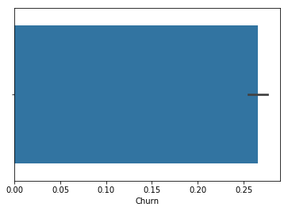
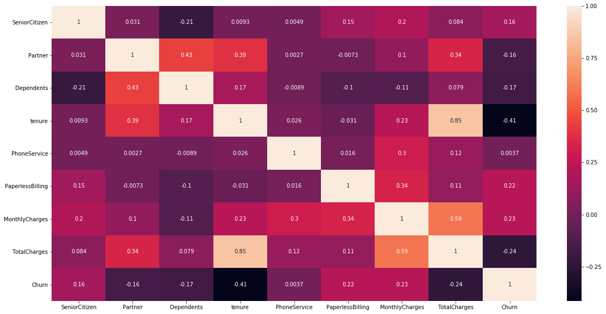
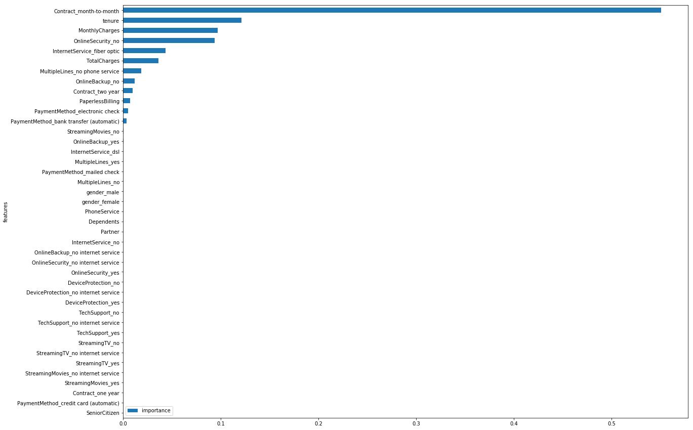
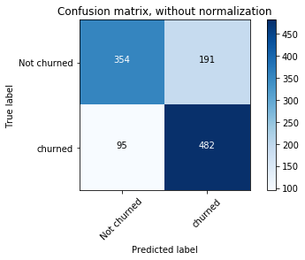
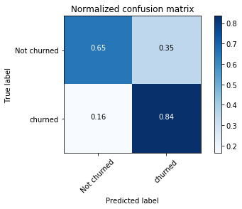

Benchmarks achieved during this project:
• Built a model in Python to predict customer churn rate using decision tree algorithm with a recall of 76%.
• Engineered features that reduced false positive rate by 40+% by using one hot encoding

```python
import numpy as np 
import pandas as pd

import seaborn as sns
import matplotlib.pyplot as plt
```


```python
df = pd.read_csv('data.csv')
df.head()
```


<div>
<table border="1" class="dataframe">
  <thead>
    <tr style="text-align: right;">
      <th></th>
      <th>customerID</th>
      <th>gender</th>
      <th>SeniorCitizen</th>
      <th>Partner</th>
      <th>Dependents</th>
      <th>tenure</th>
      <th>PhoneService</th>
      <th>MultipleLines</th>
      <th>InternetService</th>
      <th>OnlineSecurity</th>
      <th>...</th>
      <th>DeviceProtection</th>
      <th>TechSupport</th>
      <th>StreamingTV</th>
      <th>StreamingMovies</th>
      <th>Contract</th>
      <th>PaperlessBilling</th>
      <th>PaymentMethod</th>
      <th>MonthlyCharges</th>
      <th>TotalCharges</th>
      <th>Churn</th>
    </tr>
  </thead>
  <tbody>
    <tr>
      <th>0</th>
      <td>7590-VHVEG</td>
      <td>Female</td>
      <td>0</td>
      <td>Yes</td>
      <td>No</td>
      <td>1</td>
      <td>No</td>
      <td>No phone service</td>
      <td>DSL</td>
      <td>No</td>
      <td>...</td>
      <td>No</td>
      <td>No</td>
      <td>No</td>
      <td>No</td>
      <td>Month-to-month</td>
      <td>Yes</td>
      <td>Electronic check</td>
      <td>29.85</td>
      <td>29.85</td>
      <td>No</td>
    </tr>
    <tr>
      <th>1</th>
      <td>5575-GNVDE</td>
      <td>Male</td>
      <td>0</td>
      <td>No</td>
      <td>No</td>
      <td>34</td>
      <td>Yes</td>
      <td>No</td>
      <td>DSL</td>
      <td>Yes</td>
      <td>...</td>
      <td>Yes</td>
      <td>No</td>
      <td>No</td>
      <td>No</td>
      <td>One year</td>
      <td>No</td>
      <td>Mailed check</td>
      <td>56.95</td>
      <td>1889.5</td>
      <td>No</td>
    </tr>
    <tr>
      <th>2</th>
      <td>3668-QPYBK</td>
      <td>Male</td>
      <td>0</td>
      <td>No</td>
      <td>No</td>
      <td>2</td>
      <td>Yes</td>
      <td>No</td>
      <td>DSL</td>
      <td>Yes</td>
      <td>...</td>
      <td>No</td>
      <td>No</td>
      <td>No</td>
      <td>No</td>
      <td>Month-to-month</td>
      <td>Yes</td>
      <td>Mailed check</td>
      <td>53.85</td>
      <td>108.15</td>
      <td>Yes</td>
    </tr>
    <tr>
      <th>3</th>
      <td>7795-CFOCW</td>
      <td>Male</td>
      <td>0</td>
      <td>No</td>
      <td>No</td>
      <td>45</td>
      <td>No</td>
      <td>No phone service</td>
      <td>DSL</td>
      <td>Yes</td>
      <td>...</td>
      <td>Yes</td>
      <td>Yes</td>
      <td>No</td>
      <td>No</td>
      <td>One year</td>
      <td>No</td>
      <td>Bank transfer (automatic)</td>
      <td>42.30</td>
      <td>1840.75</td>
      <td>No</td>
    </tr>
    <tr>
      <th>4</th>
      <td>9237-HQITU</td>
      <td>Female</td>
      <td>0</td>
      <td>No</td>
      <td>No</td>
      <td>2</td>
      <td>Yes</td>
      <td>No</td>
      <td>Fiber optic</td>
      <td>No</td>
      <td>...</td>
      <td>No</td>
      <td>No</td>
      <td>No</td>
      <td>No</td>
      <td>Month-to-month</td>
      <td>Yes</td>
      <td>Electronic check</td>
      <td>70.70</td>
      <td>151.65</td>
      <td>Yes</td>
    </tr>
  </tbody>
</table>
<p>5 rows × 21 columns</p>
</div>


```python
df.dtypes
```


    customerID           object
    gender               object
    SeniorCitizen         int64
    Partner              object
    Dependents           object
    tenure                int64
    PhoneService         object
    MultipleLines        object
    InternetService      object
    OnlineSecurity       object
    OnlineBackup         object
    DeviceProtection     object
    TechSupport          object
    StreamingTV          object
    StreamingMovies      object
    Contract             object
    PaperlessBilling     object
    PaymentMethod        object
    MonthlyCharges      float64
    TotalCharges         object
    Churn                object
    dtype: object


```python
for item in df.columns:
    print(item)
    print (df[item].unique())
```

    customerID
    ['7590-VHVEG' '5575-GNVDE' '3668-QPYBK' ... '4801-JZAZL' '8361-LTMKD'
     '3186-AJIEK']
    gender
    ['Female' 'Male']
    SeniorCitizen
    [0 1]
    Partner
    ['Yes' 'No']
    Dependents
    ['No' 'Yes']
    tenure
    [ 1 34  2 45  8 22 10 28 62 13 16 58 49 25 69 52 71 21 12 30 47 72 17 27
      5 46 11 70 63 43 15 60 18 66  9  3 31 50 64 56  7 42 35 48 29 65 38 68
     32 55 37 36 41  6  4 33 67 23 57 61 14 20 53 40 59 24 44 19 54 51 26  0
     39]
    PhoneService
    ['No' 'Yes']
    MultipleLines
    ['No phone service' 'No' 'Yes']
    InternetService
    ['DSL' 'Fiber optic' 'No']
    OnlineSecurity
    ['No' 'Yes' 'No internet service']
    OnlineBackup
    ['Yes' 'No' 'No internet service']
    DeviceProtection
    ['No' 'Yes' 'No internet service']
    TechSupport
    ['No' 'Yes' 'No internet service']
    StreamingTV
    ['No' 'Yes' 'No internet service']
    StreamingMovies
    ['No' 'Yes' 'No internet service']
    Contract
    ['Month-to-month' 'One year' 'Two year']
    PaperlessBilling
    ['Yes' 'No']
    PaymentMethod
    ['Electronic check' 'Mailed check' 'Bank transfer (automatic)'
     'Credit card (automatic)']
    MonthlyCharges
    [29.85 56.95 53.85 ... 63.1  44.2  78.7 ]
    TotalCharges
    ['29.85' '1889.5' '108.15' ... '346.45' '306.6' '6844.5']
    Churn
    ['No' 'Yes']


```python
for item in df.columns:
    try:
        df[item] = df[item].str.lower()
    except:
        print(item, "couldn't convert")
df.head()
```

    SeniorCitizen couldn't convert
    tenure couldn't convert
    MonthlyCharges couldn't convert


<div>
<table border="1" class="dataframe">
  <thead>
    <tr style="text-align: right;">
      <th></th>
      <th>customerID</th>
      <th>gender</th>
      <th>SeniorCitizen</th>
      <th>Partner</th>
      <th>Dependents</th>
      <th>tenure</th>
      <th>PhoneService</th>
      <th>MultipleLines</th>
      <th>InternetService</th>
      <th>OnlineSecurity</th>
      <th>...</th>
      <th>DeviceProtection</th>
      <th>TechSupport</th>
      <th>StreamingTV</th>
      <th>StreamingMovies</th>
      <th>Contract</th>
      <th>PaperlessBilling</th>
      <th>PaymentMethod</th>
      <th>MonthlyCharges</th>
      <th>TotalCharges</th>
      <th>Churn</th>
    </tr>
  </thead>
  <tbody>
    <tr>
      <th>0</th>
      <td>7590-vhveg</td>
      <td>female</td>
      <td>0</td>
      <td>yes</td>
      <td>no</td>
      <td>1</td>
      <td>no</td>
      <td>no phone service</td>
      <td>dsl</td>
      <td>no</td>
      <td>...</td>
      <td>no</td>
      <td>no</td>
      <td>no</td>
      <td>no</td>
      <td>month-to-month</td>
      <td>yes</td>
      <td>electronic check</td>
      <td>29.85</td>
      <td>29.85</td>
      <td>no</td>
    </tr>
    <tr>
      <th>1</th>
      <td>5575-gnvde</td>
      <td>male</td>
      <td>0</td>
      <td>no</td>
      <td>no</td>
      <td>34</td>
      <td>yes</td>
      <td>no</td>
      <td>dsl</td>
      <td>yes</td>
      <td>...</td>
      <td>yes</td>
      <td>no</td>
      <td>no</td>
      <td>no</td>
      <td>one year</td>
      <td>no</td>
      <td>mailed check</td>
      <td>56.95</td>
      <td>1889.5</td>
      <td>no</td>
    </tr>
    <tr>
      <th>2</th>
      <td>3668-qpybk</td>
      <td>male</td>
      <td>0</td>
      <td>no</td>
      <td>no</td>
      <td>2</td>
      <td>yes</td>
      <td>no</td>
      <td>dsl</td>
      <td>yes</td>
      <td>...</td>
      <td>no</td>
      <td>no</td>
      <td>no</td>
      <td>no</td>
      <td>month-to-month</td>
      <td>yes</td>
      <td>mailed check</td>
      <td>53.85</td>
      <td>108.15</td>
      <td>yes</td>
    </tr>
    <tr>
      <th>3</th>
      <td>7795-cfocw</td>
      <td>male</td>
      <td>0</td>
      <td>no</td>
      <td>no</td>
      <td>45</td>
      <td>no</td>
      <td>no phone service</td>
      <td>dsl</td>
      <td>yes</td>
      <td>...</td>
      <td>yes</td>
      <td>yes</td>
      <td>no</td>
      <td>no</td>
      <td>one year</td>
      <td>no</td>
      <td>bank transfer (automatic)</td>
      <td>42.30</td>
      <td>1840.75</td>
      <td>no</td>
    </tr>
    <tr>
      <th>4</th>
      <td>9237-hqitu</td>
      <td>female</td>
      <td>0</td>
      <td>no</td>
      <td>no</td>
      <td>2</td>
      <td>yes</td>
      <td>no</td>
      <td>fiber optic</td>
      <td>no</td>
      <td>...</td>
      <td>no</td>
      <td>no</td>
      <td>no</td>
      <td>no</td>
      <td>month-to-month</td>
      <td>yes</td>
      <td>electronic check</td>
      <td>70.70</td>
      <td>151.65</td>
      <td>yes</td>
    </tr>
  </tbody>
</table>
<p>5 rows × 21 columns</p>
</div>


```python
columns_to_convert = ['Partner', 
                      'Dependents', 
                      'PhoneService', 
                      'PaperlessBilling', 
                      'Churn']

for item in columns_to_convert:
    df[item].replace(to_replace='yes', value=1, inplace=True)
    df[item].replace(to_replace='no',  value=0, inplace=True)
df.head()
```


<div>
<table border="1" class="dataframe">
  <thead>
    <tr style="text-align: right;">
      <th></th>
      <th>customerID</th>
      <th>gender</th>
      <th>SeniorCitizen</th>
      <th>Partner</th>
      <th>Dependents</th>
      <th>tenure</th>
      <th>PhoneService</th>
      <th>MultipleLines</th>
      <th>InternetService</th>
      <th>OnlineSecurity</th>
      <th>...</th>
      <th>DeviceProtection</th>
      <th>TechSupport</th>
      <th>StreamingTV</th>
      <th>StreamingMovies</th>
      <th>Contract</th>
      <th>PaperlessBilling</th>
      <th>PaymentMethod</th>
      <th>MonthlyCharges</th>
      <th>TotalCharges</th>
      <th>Churn</th>
    </tr>
  </thead>
  <tbody>
    <tr>
      <th>0</th>
      <td>7590-vhveg</td>
      <td>female</td>
      <td>0</td>
      <td>1</td>
      <td>0</td>
      <td>1</td>
      <td>0</td>
      <td>no phone service</td>
      <td>dsl</td>
      <td>no</td>
      <td>...</td>
      <td>no</td>
      <td>no</td>
      <td>no</td>
      <td>no</td>
      <td>month-to-month</td>
      <td>1</td>
      <td>electronic check</td>
      <td>29.85</td>
      <td>29.85</td>
      <td>0</td>
    </tr>
    <tr>
      <th>1</th>
      <td>5575-gnvde</td>
      <td>male</td>
      <td>0</td>
      <td>0</td>
      <td>0</td>
      <td>34</td>
      <td>1</td>
      <td>no</td>
      <td>dsl</td>
      <td>yes</td>
      <td>...</td>
      <td>yes</td>
      <td>no</td>
      <td>no</td>
      <td>no</td>
      <td>one year</td>
      <td>0</td>
      <td>mailed check</td>
      <td>56.95</td>
      <td>1889.5</td>
      <td>0</td>
    </tr>
    <tr>
      <th>2</th>
      <td>3668-qpybk</td>
      <td>male</td>
      <td>0</td>
      <td>0</td>
      <td>0</td>
      <td>2</td>
      <td>1</td>
      <td>no</td>
      <td>dsl</td>
      <td>yes</td>
      <td>...</td>
      <td>no</td>
      <td>no</td>
      <td>no</td>
      <td>no</td>
      <td>month-to-month</td>
      <td>1</td>
      <td>mailed check</td>
      <td>53.85</td>
      <td>108.15</td>
      <td>1</td>
    </tr>
    <tr>
      <th>3</th>
      <td>7795-cfocw</td>
      <td>male</td>
      <td>0</td>
      <td>0</td>
      <td>0</td>
      <td>45</td>
      <td>0</td>
      <td>no phone service</td>
      <td>dsl</td>
      <td>yes</td>
      <td>...</td>
      <td>yes</td>
      <td>yes</td>
      <td>no</td>
      <td>no</td>
      <td>one year</td>
      <td>0</td>
      <td>bank transfer (automatic)</td>
      <td>42.30</td>
      <td>1840.75</td>
      <td>0</td>
    </tr>
    <tr>
      <th>4</th>
      <td>9237-hqitu</td>
      <td>female</td>
      <td>0</td>
      <td>0</td>
      <td>0</td>
      <td>2</td>
      <td>1</td>
      <td>no</td>
      <td>fiber optic</td>
      <td>no</td>
      <td>...</td>
      <td>no</td>
      <td>no</td>
      <td>no</td>
      <td>no</td>
      <td>month-to-month</td>
      <td>1</td>
      <td>electronic check</td>
      <td>70.70</td>
      <td>151.65</td>
      <td>1</td>
    </tr>
  </tbody>
</table>
<p>5 rows × 21 columns</p>
</div>


```python
df.dtypes
```


    customerID           object
    gender               object
    SeniorCitizen         int64
    Partner               int64
    Dependents            int64
    tenure                int64
    PhoneService          int64
    MultipleLines        object
    InternetService      object
    OnlineSecurity       object
    OnlineBackup         object
    DeviceProtection     object
    TechSupport          object
    StreamingTV          object
    StreamingMovies      object
    Contract             object
    PaperlessBilling      int64
    PaymentMethod        object
    MonthlyCharges      float64
    TotalCharges         object
    Churn                 int64
    dtype: object


```python
# ax = sns.countplot(x="Churn", data=df, orient='v')
print("Customer Churn:",(df['Churn'] == 1).sum())
sns.barplot(x="Churn", data=df)
```

    Customer Churn: 1869


    <matplotlib.axes._subplots.AxesSubplot at 0x1a103fd240>





```python
#replace if total charges has any spaces and convert it to numeric
df['TotalCharges'] = df['TotalCharges'].replace(r'\s+', np.nan, regex=True)
df['TotalCharges'] = pd.to_numeric(df['TotalCharges'])
```


```python
#get total number of null in each columns 
df.isnull().sum(axis = 0)
```


    customerID           0
    gender               0
    SeniorCitizen        0
    Partner              0
    Dependents           0
    tenure               0
    PhoneService         0
    MultipleLines        0
    InternetService      0
    OnlineSecurity       0
    OnlineBackup         0
    DeviceProtection     0
    TechSupport          0
    StreamingTV          0
    StreamingMovies      0
    Contract             0
    PaperlessBilling     0
    PaymentMethod        0
    MonthlyCharges       0
    TotalCharges        11
    Churn                0
    dtype: int64


```python
#replacing null with zeros
df = df.fillna(value=0)
```


```python
churners_count = len(df[df['Churn'] == 1])
churners = (df[df['Churn'] == 1])
non_churners = df[df['Churn'] == 0].sample(n=churners_count)
df2 = churners.append(non_churners)
```


```python
def show_correlations(dataframe, show_chart = True):
    fig = plt.figure(figsize = (20,10))
    corr = dataframe.corr()
    if show_chart == True:
        sns.heatmap(corr, 
                    xticklabels=corr.columns.values,
                    yticklabels=corr.columns.values,
                    annot=True)
    return corr

show_correlations(df2,show_chart=True)
```


<div>
<table border="1" class="dataframe">
  <thead>
    <tr style="text-align: right;">
      <th></th>
      <th>SeniorCitizen</th>
      <th>Partner</th>
      <th>Dependents</th>
      <th>tenure</th>
      <th>PhoneService</th>
      <th>PaperlessBilling</th>
      <th>MonthlyCharges</th>
      <th>TotalCharges</th>
      <th>Churn</th>
    </tr>
  </thead>
  <tbody>
    <tr>
      <th>SeniorCitizen</th>
      <td>1.000000</td>
      <td>0.033950</td>
      <td>-0.216994</td>
      <td>0.016501</td>
      <td>-0.004327</td>
      <td>0.154763</td>
      <td>0.202354</td>
      <td>0.087239</td>
      <td>0.164277</td>
    </tr>
    <tr>
      <th>Partner</th>
      <td>0.033950</td>
      <td>1.000000</td>
      <td>0.441274</td>
      <td>0.375380</td>
      <td>-0.002699</td>
      <td>-0.013015</td>
      <td>0.080432</td>
      <td>0.319740</td>
      <td>-0.166508</td>
    </tr>
    <tr>
      <th>Dependents</th>
      <td>-0.216994</td>
      <td>0.441274</td>
      <td>1.000000</td>
      <td>0.181564</td>
      <td>-0.003626</td>
      <td>-0.133966</td>
      <td>-0.126351</td>
      <td>0.081688</td>
      <td>-0.209236</td>
    </tr>
    <tr>
      <th>tenure</th>
      <td>0.016501</td>
      <td>0.375380</td>
      <td>0.181564</td>
      <td>1.000000</td>
      <td>0.013852</td>
      <td>-0.018544</td>
      <td>0.233362</td>
      <td>0.861143</td>
      <td>-0.407836</td>
    </tr>
    <tr>
      <th>PhoneService</th>
      <td>-0.004327</td>
      <td>-0.002699</td>
      <td>-0.003626</td>
      <td>0.013852</td>
      <td>1.000000</td>
      <td>0.033300</td>
      <td>0.305843</td>
      <td>0.117907</td>
      <td>0.011893</td>
    </tr>
    <tr>
      <th>PaperlessBilling</th>
      <td>0.154763</td>
      <td>-0.013015</td>
      <td>-0.133966</td>
      <td>-0.018544</td>
      <td>0.033300</td>
      <td>1.000000</td>
      <td>0.336252</td>
      <td>0.113081</td>
      <td>0.224259</td>
    </tr>
    <tr>
      <th>MonthlyCharges</th>
      <td>0.202354</td>
      <td>0.080432</td>
      <td>-0.126351</td>
      <td>0.233362</td>
      <td>0.305843</td>
      <td>0.336252</td>
      <td>1.000000</td>
      <td>0.584964</td>
      <td>0.222854</td>
    </tr>
    <tr>
      <th>TotalCharges</th>
      <td>0.087239</td>
      <td>0.319740</td>
      <td>0.081688</td>
      <td>0.861143</td>
      <td>0.117907</td>
      <td>0.113081</td>
      <td>0.584964</td>
      <td>1.000000</td>
      <td>-0.237921</td>
    </tr>
    <tr>
      <th>Churn</th>
      <td>0.164277</td>
      <td>-0.166508</td>
      <td>-0.209236</td>
      <td>-0.407836</td>
      <td>0.011893</td>
      <td>0.224259</td>
      <td>0.222854</td>
      <td>-0.237921</td>
      <td>1.000000</td>
    </tr>
  </tbody>
</table>
</div>





Here we see if the Tenure is high then churn is low.


```python
try:
    customer_id = df2['customerID'] # Store this as customer_id variable
    del df2['customerID'] # Don't need in ML DF
except:
    print("already removed customerID")
```


```python
df2.head()
```


<div>
<table border="1" class="dataframe">
  <thead>
    <tr style="text-align: right;">
      <th></th>
      <th>gender</th>
      <th>SeniorCitizen</th>
      <th>Partner</th>
      <th>Dependents</th>
      <th>tenure</th>
      <th>PhoneService</th>
      <th>MultipleLines</th>
      <th>InternetService</th>
      <th>OnlineSecurity</th>
      <th>OnlineBackup</th>
      <th>DeviceProtection</th>
      <th>TechSupport</th>
      <th>StreamingTV</th>
      <th>StreamingMovies</th>
      <th>Contract</th>
      <th>PaperlessBilling</th>
      <th>PaymentMethod</th>
      <th>MonthlyCharges</th>
      <th>TotalCharges</th>
      <th>Churn</th>
    </tr>
  </thead>
  <tbody>
    <tr>
      <th>2</th>
      <td>male</td>
      <td>0</td>
      <td>0</td>
      <td>0</td>
      <td>2</td>
      <td>1</td>
      <td>no</td>
      <td>dsl</td>
      <td>yes</td>
      <td>yes</td>
      <td>no</td>
      <td>no</td>
      <td>no</td>
      <td>no</td>
      <td>month-to-month</td>
      <td>1</td>
      <td>mailed check</td>
      <td>53.85</td>
      <td>108.15</td>
      <td>1</td>
    </tr>
    <tr>
      <th>4</th>
      <td>female</td>
      <td>0</td>
      <td>0</td>
      <td>0</td>
      <td>2</td>
      <td>1</td>
      <td>no</td>
      <td>fiber optic</td>
      <td>no</td>
      <td>no</td>
      <td>no</td>
      <td>no</td>
      <td>no</td>
      <td>no</td>
      <td>month-to-month</td>
      <td>1</td>
      <td>electronic check</td>
      <td>70.70</td>
      <td>151.65</td>
      <td>1</td>
    </tr>
    <tr>
      <th>5</th>
      <td>female</td>
      <td>0</td>
      <td>0</td>
      <td>0</td>
      <td>8</td>
      <td>1</td>
      <td>yes</td>
      <td>fiber optic</td>
      <td>no</td>
      <td>no</td>
      <td>yes</td>
      <td>no</td>
      <td>yes</td>
      <td>yes</td>
      <td>month-to-month</td>
      <td>1</td>
      <td>electronic check</td>
      <td>99.65</td>
      <td>820.50</td>
      <td>1</td>
    </tr>
    <tr>
      <th>8</th>
      <td>female</td>
      <td>0</td>
      <td>1</td>
      <td>0</td>
      <td>28</td>
      <td>1</td>
      <td>yes</td>
      <td>fiber optic</td>
      <td>no</td>
      <td>no</td>
      <td>yes</td>
      <td>yes</td>
      <td>yes</td>
      <td>yes</td>
      <td>month-to-month</td>
      <td>1</td>
      <td>electronic check</td>
      <td>104.80</td>
      <td>3046.05</td>
      <td>1</td>
    </tr>
    <tr>
      <th>13</th>
      <td>male</td>
      <td>0</td>
      <td>0</td>
      <td>0</td>
      <td>49</td>
      <td>1</td>
      <td>yes</td>
      <td>fiber optic</td>
      <td>no</td>
      <td>yes</td>
      <td>yes</td>
      <td>no</td>
      <td>yes</td>
      <td>yes</td>
      <td>month-to-month</td>
      <td>1</td>
      <td>bank transfer (automatic)</td>
      <td>103.70</td>
      <td>5036.30</td>
      <td>1</td>
    </tr>
  </tbody>
</table>
</div>


```python
#Using one-hot encoding to convert categorical data to binary (0 or 1)
ml_dummies = pd.get_dummies(df2)
ml_dummies.fillna(value=0, inplace=True)
ml_dummies.head()
```


<div>
<table border="1" class="dataframe">
  <thead>
    <tr style="text-align: right;">
      <th></th>
      <th>SeniorCitizen</th>
      <th>Partner</th>
      <th>Dependents</th>
      <th>tenure</th>
      <th>PhoneService</th>
      <th>PaperlessBilling</th>
      <th>MonthlyCharges</th>
      <th>TotalCharges</th>
      <th>Churn</th>
      <th>gender_female</th>
      <th>...</th>
      <th>StreamingMovies_no</th>
      <th>StreamingMovies_no internet service</th>
      <th>StreamingMovies_yes</th>
      <th>Contract_month-to-month</th>
      <th>Contract_one year</th>
      <th>Contract_two year</th>
      <th>PaymentMethod_bank transfer (automatic)</th>
      <th>PaymentMethod_credit card (automatic)</th>
      <th>PaymentMethod_electronic check</th>
      <th>PaymentMethod_mailed check</th>
    </tr>
  </thead>
  <tbody>
    <tr>
      <th>2</th>
      <td>0</td>
      <td>0</td>
      <td>0</td>
      <td>2</td>
      <td>1</td>
      <td>1</td>
      <td>53.85</td>
      <td>108.15</td>
      <td>1</td>
      <td>0</td>
      <td>...</td>
      <td>1</td>
      <td>0</td>
      <td>0</td>
      <td>1</td>
      <td>0</td>
      <td>0</td>
      <td>0</td>
      <td>0</td>
      <td>0</td>
      <td>1</td>
    </tr>
    <tr>
      <th>4</th>
      <td>0</td>
      <td>0</td>
      <td>0</td>
      <td>2</td>
      <td>1</td>
      <td>1</td>
      <td>70.70</td>
      <td>151.65</td>
      <td>1</td>
      <td>1</td>
      <td>...</td>
      <td>1</td>
      <td>0</td>
      <td>0</td>
      <td>1</td>
      <td>0</td>
      <td>0</td>
      <td>0</td>
      <td>0</td>
      <td>1</td>
      <td>0</td>
    </tr>
    <tr>
      <th>5</th>
      <td>0</td>
      <td>0</td>
      <td>0</td>
      <td>8</td>
      <td>1</td>
      <td>1</td>
      <td>99.65</td>
      <td>820.50</td>
      <td>1</td>
      <td>1</td>
      <td>...</td>
      <td>0</td>
      <td>0</td>
      <td>1</td>
      <td>1</td>
      <td>0</td>
      <td>0</td>
      <td>0</td>
      <td>0</td>
      <td>1</td>
      <td>0</td>
    </tr>
    <tr>
      <th>8</th>
      <td>0</td>
      <td>1</td>
      <td>0</td>
      <td>28</td>
      <td>1</td>
      <td>1</td>
      <td>104.80</td>
      <td>3046.05</td>
      <td>1</td>
      <td>1</td>
      <td>...</td>
      <td>0</td>
      <td>0</td>
      <td>1</td>
      <td>1</td>
      <td>0</td>
      <td>0</td>
      <td>0</td>
      <td>0</td>
      <td>1</td>
      <td>0</td>
    </tr>
    <tr>
      <th>13</th>
      <td>0</td>
      <td>0</td>
      <td>0</td>
      <td>49</td>
      <td>1</td>
      <td>1</td>
      <td>103.70</td>
      <td>5036.30</td>
      <td>1</td>
      <td>0</td>
      <td>...</td>
      <td>0</td>
      <td>0</td>
      <td>1</td>
      <td>1</td>
      <td>0</td>
      <td>0</td>
      <td>1</td>
      <td>0</td>
      <td>0</td>
      <td>0</td>
    </tr>
  </tbody>
</table>
<p>5 rows × 42 columns</p>
</div>


```python
try:
    target = ml_dummies['Churn'] # Remove the label before training the model
    del ml_dummies['Churn']
except:
    print("target already removed.")

from sklearn.model_selection import train_test_split
feature_train, feature_test, label_train, label_test = train_test_split(ml_dummies, target, test_size=0.3)
```


```python
# Classifiers
from sklearn.neighbors import KNeighborsClassifier
from sklearn.tree import DecisionTreeClassifier
from sklearn.model_selection import cross_val_score

classifiers = [
    KNeighborsClassifier(5),    
    DecisionTreeClassifier(max_depth=5)]
    

# iterate over classifiers
for item in classifiers:
    classifier_name = ((str(item)[:(str(item).find("("))]))
    print (classifier_name)
    
    # Create classifier, train it and test it.
    clf = item
    clf.fit(feature_train, label_train)
    pred = clf.predict(feature_test)
    score = clf.score(feature_test, label_test)
    print (round(score,3),"\n", "- - - - - ", "\n")
    
    # Cross Validation
    cv_results = cross_val_score(clf, ml_dummies, target, cv=10)
    print (round(np.mean(cv_results),3),"\n", "- - - - - ", "\n")
    
    
feature_df = pd.DataFrame()
feature_df['features'] = ml_dummies.columns
feature_df['importance'] = clf.feature_importances_
feature_df.set_index('features').sort_values(by='importance', ascending=True).plot(kind='barh', figsize=(20, 15))
print(feature_df.sort_values(by='importance', ascending=True))
```

    KNeighborsClassifier
    0.697 
     - - - - -  
    
    0.697 
     - - - - -  
    
    DecisionTreeClassifier
    0.753 
     - - - - -  
    
    0.753 
     - - - - -  
    
                                       features  importance
    0                             SeniorCitizen    0.000000
    38    PaymentMethod_credit card (automatic)    0.000000
    37  PaymentMethod_bank transfer (automatic)    0.000000
    36                        Contract_two year    0.000000
    32      StreamingMovies_no internet service    0.000000
    31                       StreamingMovies_no    0.000000
    30                          StreamingTV_yes    0.000000
    29          StreamingTV_no internet service    0.000000
    28                           StreamingTV_no    0.000000
    26          TechSupport_no internet service    0.000000
    25                           TechSupport_no    0.000000
    24                     DeviceProtection_yes    0.000000
    23     DeviceProtection_no internet service    0.000000
    22                      DeviceProtection_no    0.000000
    21                         OnlineBackup_yes    0.000000
    17       OnlineSecurity_no internet service    0.000000
    20         OnlineBackup_no internet service    0.000000
    15                       InternetService_no    0.000000
    1                                   Partner    0.000000
    2                                Dependents    0.000000
    4                              PhoneService    0.000000
    9                               gender_male    0.000000
    10                         MultipleLines_no    0.000000
    11           MultipleLines_no phone service    0.000000
    8                             gender_female    0.000000
    12                        MultipleLines_yes    0.000000
    40               PaymentMethod_mailed check    0.000000
    18                       OnlineSecurity_yes    0.001574
    33                      StreamingMovies_yes    0.003025
    27                          TechSupport_yes    0.003104
    39           PaymentMethod_electronic check    0.008869
    19                          OnlineBackup_no    0.012050
    5                          PaperlessBilling    0.018717
    35                        Contract_one year    0.022320
    7                              TotalCharges    0.030484
    14              InternetService_fiber optic    0.037100
    13                      InternetService_dsl    0.038197
    3                                    tenure    0.059679
    6                            MonthlyCharges    0.066997
    16                        OnlineSecurity_no    0.110701
    34                  Contract_month-to-month    0.587184





```python
# Confusion matrix
from sklearn.metrics import confusion_matrix
import itertools

def plot_confusion_matrix(cm, classes,
                          normalize=False,
                          title='Confusion matrix',
                          cmap=plt.cm.Blues):
    """
    This function prints and plots the confusion matrix.
    Normalization can be applied by setting `normalize=True`.
    """
    if normalize:
        cm = cm.astype('float') / cm.sum(axis=1)[:, np.newaxis]
        print("Normalized confusion matrix")
    else:
        print('Confusion matrix, without normalization')

    print(cm)

    plt.imshow(cm, interpolation='nearest', cmap=cmap)
    plt.title(title)
    plt.colorbar()
    tick_marks = np.arange(len(classes))
    plt.xticks(tick_marks, classes, rotation=45)
    plt.yticks(tick_marks, classes)

    fmt = '.2f' if normalize else 'd'
    thresh = cm.max() / 2.
    for i, j in itertools.product(range(cm.shape[0]), range(cm.shape[1])):
        plt.text(j, i, format(cm[i, j], fmt),
                 horizontalalignment="center",
                 color="white" if cm[i, j] > thresh else "black")

    plt.tight_layout()
    plt.ylabel('True label')
    plt.xlabel('Predicted label')

# Compute confusion matrix
cnf_matrix = confusion_matrix(label_test, pred)
np.set_printoptions(precision=2)

# Plot non-normalized confusion matrix
plt.figure()
class_names = ['Not churned','churned']

plot_confusion_matrix(cnf_matrix, classes=class_names,
                      title='Confusion matrix, without normalization')

# Plot normalized confusion matrix
plt.figure()
plot_confusion_matrix(cnf_matrix, classes=class_names, normalize=True,
                      title='Normalized confusion matrix')

plt.show()


from sklearn.metrics import classification_report
eval_metrics = classification_report(label_test, pred, target_names=class_names)
print(eval_metrics)
```

    Confusion matrix, without normalization
    [[425 143]
     [134 420]]
    Normalized confusion matrix
    [[0.75 0.25]
     [0.24 0.76]]








                 precision    recall  f1-score   support
    
    Not churned       0.76      0.75      0.75       568
        churned       0.75      0.76      0.75       554
    
    avg / total       0.75      0.75      0.75      1122
    


```python
output_df = ml_dummies
output_df['prediction'] = clf.predict_proba(output_df)[:,1]
output_df['churn'] = target
output_df['customerID'] = customer_id

print('Mean predict proba of churn:',round(output_df[output_df['churn'] == 1]['prediction'].mean(),2))
print('Mean predict proba of NON-churn:',round(output_df[output_df['churn'] == 0]['prediction'].mean(),2))
```

    Mean predict proba of churn: 0.7
    Mean predict proba of NON-churn: 0.3


```python
activate = output_df[output_df['churn'] == 0]
activate.sort_values(by='prediction', ascending=False)
```


<div>
<table border="1" class="dataframe">
  <thead>
    <tr style="text-align: right;">
      <th></th>
      <th>SeniorCitizen</th>
      <th>Partner</th>
      <th>Dependents</th>
      <th>tenure</th>
      <th>PhoneService</th>
      <th>PaperlessBilling</th>
      <th>MonthlyCharges</th>
      <th>TotalCharges</th>
      <th>gender_female</th>
      <th>gender_male</th>
      <th>...</th>
      <th>Contract_month-to-month</th>
      <th>Contract_one year</th>
      <th>Contract_two year</th>
      <th>PaymentMethod_bank transfer (automatic)</th>
      <th>PaymentMethod_credit card (automatic)</th>
      <th>PaymentMethod_electronic check</th>
      <th>PaymentMethod_mailed check</th>
      <th>prediction</th>
      <th>churn</th>
      <th>customerID</th>
    </tr>
  </thead>
  <tbody>
    <tr>
      <th>4704</th>
      <td>0</td>
      <td>0</td>
      <td>0</td>
      <td>1</td>
      <td>1</td>
      <td>0</td>
      <td>61.15</td>
      <td>61.15</td>
      <td>0</td>
      <td>1</td>
      <td>...</td>
      <td>1</td>
      <td>0</td>
      <td>0</td>
      <td>0</td>
      <td>0</td>
      <td>1</td>
      <td>0</td>
      <td>1.000000</td>
      <td>0</td>
      <td>1928-bxyiv</td>
    </tr>
    <tr>
      <th>5436</th>
      <td>0</td>
      <td>0</td>
      <td>1</td>
      <td>1</td>
      <td>1</td>
      <td>0</td>
      <td>54.50</td>
      <td>54.50</td>
      <td>1</td>
      <td>0</td>
      <td>...</td>
      <td>1</td>
      <td>0</td>
      <td>0</td>
      <td>0</td>
      <td>0</td>
      <td>1</td>
      <td>0</td>
      <td>1.000000</td>
      <td>0</td>
      <td>7246-zgqdf</td>
    </tr>
    <tr>
      <th>3582</th>
      <td>0</td>
      <td>0</td>
      <td>0</td>
      <td>3</td>
      <td>1</td>
      <td>1</td>
      <td>80.50</td>
      <td>232.35</td>
      <td>1</td>
      <td>0</td>
      <td>...</td>
      <td>1</td>
      <td>0</td>
      <td>0</td>
      <td>0</td>
      <td>0</td>
      <td>1</td>
      <td>0</td>
      <td>0.909314</td>
      <td>0</td>
      <td>6357-jjpqt</td>
    </tr>
    <tr>
      <th>2548</th>
      <td>1</td>
      <td>0</td>
      <td>0</td>
      <td>8</td>
      <td>1</td>
      <td>1</td>
      <td>69.95</td>
      <td>562.70</td>
      <td>0</td>
      <td>1</td>
      <td>...</td>
      <td>1</td>
      <td>0</td>
      <td>0</td>
      <td>0</td>
      <td>1</td>
      <td>0</td>
      <td>0</td>
      <td>0.909314</td>
      <td>0</td>
      <td>9796-bpkiw</td>
    </tr>
    <tr>
      <th>6610</th>
      <td>0</td>
      <td>0</td>
      <td>0</td>
      <td>5</td>
      <td>1</td>
      <td>1</td>
      <td>80.10</td>
      <td>398.55</td>
      <td>0</td>
      <td>1</td>
      <td>...</td>
      <td>1</td>
      <td>0</td>
      <td>0</td>
      <td>0</td>
      <td>0</td>
      <td>0</td>
      <td>1</td>
      <td>0.909314</td>
      <td>0</td>
      <td>9696-rmyba</td>
    </tr>
    <tr>
      <th>5354</th>
      <td>0</td>
      <td>0</td>
      <td>1</td>
      <td>1</td>
      <td>1</td>
      <td>1</td>
      <td>89.35</td>
      <td>89.35</td>
      <td>1</td>
      <td>0</td>
      <td>...</td>
      <td>1</td>
      <td>0</td>
      <td>0</td>
      <td>0</td>
      <td>0</td>
      <td>1</td>
      <td>0</td>
      <td>0.909314</td>
      <td>0</td>
      <td>4273-mbhya</td>
    </tr>
    <tr>
      <th>4484</th>
      <td>0</td>
      <td>0</td>
      <td>0</td>
      <td>1</td>
      <td>1</td>
      <td>1</td>
      <td>70.35</td>
      <td>70.35</td>
      <td>0</td>
      <td>1</td>
      <td>...</td>
      <td>1</td>
      <td>0</td>
      <td>0</td>
      <td>0</td>
      <td>0</td>
      <td>1</td>
      <td>0</td>
      <td>0.909314</td>
      <td>0</td>
      <td>7465-zzrvx</td>
    </tr>
    <tr>
      <th>1963</th>
      <td>0</td>
      <td>0</td>
      <td>0</td>
      <td>8</td>
      <td>1</td>
      <td>0</td>
      <td>70.70</td>
      <td>553.40</td>
      <td>0</td>
      <td>1</td>
      <td>...</td>
      <td>1</td>
      <td>0</td>
      <td>0</td>
      <td>1</td>
      <td>0</td>
      <td>0</td>
      <td>0</td>
      <td>0.909314</td>
      <td>0</td>
      <td>7967-hycde</td>
    </tr>
    <tr>
      <th>2173</th>
      <td>0</td>
      <td>0</td>
      <td>0</td>
      <td>4</td>
      <td>1</td>
      <td>0</td>
      <td>86.05</td>
      <td>308.10</td>
      <td>0</td>
      <td>1</td>
      <td>...</td>
      <td>1</td>
      <td>0</td>
      <td>0</td>
      <td>0</td>
      <td>0</td>
      <td>1</td>
      <td>0</td>
      <td>0.909314</td>
      <td>0</td>
      <td>2038-oeqzh</td>
    </tr>
    <tr>
      <th>313</th>
      <td>1</td>
      <td>1</td>
      <td>0</td>
      <td>5</td>
      <td>1</td>
      <td>1</td>
      <td>69.35</td>
      <td>341.60</td>
      <td>1</td>
      <td>0</td>
      <td>...</td>
      <td>1</td>
      <td>0</td>
      <td>0</td>
      <td>0</td>
      <td>0</td>
      <td>1</td>
      <td>0</td>
      <td>0.909314</td>
      <td>0</td>
      <td>2799-arnlo</td>
    </tr>
    <tr>
      <th>6481</th>
      <td>0</td>
      <td>1</td>
      <td>1</td>
      <td>5</td>
      <td>1</td>
      <td>0</td>
      <td>69.95</td>
      <td>320.40</td>
      <td>1</td>
      <td>0</td>
      <td>...</td>
      <td>1</td>
      <td>0</td>
      <td>0</td>
      <td>0</td>
      <td>1</td>
      <td>0</td>
      <td>0</td>
      <td>0.909314</td>
      <td>0</td>
      <td>9389-acwbi</td>
    </tr>
    <tr>
      <th>1002</th>
      <td>0</td>
      <td>1</td>
      <td>1</td>
      <td>4</td>
      <td>1</td>
      <td>1</td>
      <td>69.55</td>
      <td>284.90</td>
      <td>0</td>
      <td>1</td>
      <td>...</td>
      <td>1</td>
      <td>0</td>
      <td>0</td>
      <td>0</td>
      <td>0</td>
      <td>0</td>
      <td>1</td>
      <td>0.909314</td>
      <td>0</td>
      <td>8120-jdcam</td>
    </tr>
    <tr>
      <th>2447</th>
      <td>0</td>
      <td>0</td>
      <td>0</td>
      <td>7</td>
      <td>1</td>
      <td>1</td>
      <td>74.90</td>
      <td>490.55</td>
      <td>0</td>
      <td>1</td>
      <td>...</td>
      <td>1</td>
      <td>0</td>
      <td>0</td>
      <td>0</td>
      <td>0</td>
      <td>1</td>
      <td>0</td>
      <td>0.909314</td>
      <td>0</td>
      <td>1475-vwvdo</td>
    </tr>
    <tr>
      <th>6770</th>
      <td>0</td>
      <td>1</td>
      <td>1</td>
      <td>4</td>
      <td>1</td>
      <td>1</td>
      <td>78.90</td>
      <td>299.75</td>
      <td>1</td>
      <td>0</td>
      <td>...</td>
      <td>1</td>
      <td>0</td>
      <td>0</td>
      <td>0</td>
      <td>0</td>
      <td>0</td>
      <td>1</td>
      <td>0.909314</td>
      <td>0</td>
      <td>3855-oncar</td>
    </tr>
    <tr>
      <th>1903</th>
      <td>0</td>
      <td>0</td>
      <td>0</td>
      <td>3</td>
      <td>1</td>
      <td>1</td>
      <td>92.00</td>
      <td>266.80</td>
      <td>0</td>
      <td>1</td>
      <td>...</td>
      <td>1</td>
      <td>0</td>
      <td>0</td>
      <td>0</td>
      <td>0</td>
      <td>1</td>
      <td>0</td>
      <td>0.909314</td>
      <td>0</td>
      <td>3318-nmqxl</td>
    </tr>
    <tr>
      <th>1079</th>
      <td>0</td>
      <td>1</td>
      <td>1</td>
      <td>3</td>
      <td>1</td>
      <td>1</td>
      <td>69.55</td>
      <td>200.20</td>
      <td>1</td>
      <td>0</td>
      <td>...</td>
      <td>1</td>
      <td>0</td>
      <td>0</td>
      <td>0</td>
      <td>0</td>
      <td>1</td>
      <td>0</td>
      <td>0.909314</td>
      <td>0</td>
      <td>0455-xfass</td>
    </tr>
    <tr>
      <th>5071</th>
      <td>0</td>
      <td>1</td>
      <td>0</td>
      <td>1</td>
      <td>1</td>
      <td>0</td>
      <td>75.35</td>
      <td>75.35</td>
      <td>0</td>
      <td>1</td>
      <td>...</td>
      <td>1</td>
      <td>0</td>
      <td>0</td>
      <td>0</td>
      <td>1</td>
      <td>0</td>
      <td>0</td>
      <td>0.909314</td>
      <td>0</td>
      <td>1746-tgtwv</td>
    </tr>
    <tr>
      <th>4072</th>
      <td>1</td>
      <td>0</td>
      <td>0</td>
      <td>9</td>
      <td>1</td>
      <td>1</td>
      <td>79.55</td>
      <td>718.55</td>
      <td>0</td>
      <td>1</td>
      <td>...</td>
      <td>1</td>
      <td>0</td>
      <td>0</td>
      <td>0</td>
      <td>0</td>
      <td>1</td>
      <td>0</td>
      <td>0.909314</td>
      <td>0</td>
      <td>2688-bhgog</td>
    </tr>
    <tr>
      <th>935</th>
      <td>1</td>
      <td>1</td>
      <td>0</td>
      <td>4</td>
      <td>1</td>
      <td>1</td>
      <td>83.25</td>
      <td>308.05</td>
      <td>1</td>
      <td>0</td>
      <td>...</td>
      <td>1</td>
      <td>0</td>
      <td>0</td>
      <td>0</td>
      <td>0</td>
      <td>1</td>
      <td>0</td>
      <td>0.909314</td>
      <td>0</td>
      <td>6630-ujzmy</td>
    </tr>
    <tr>
      <th>2453</th>
      <td>1</td>
      <td>0</td>
      <td>0</td>
      <td>4</td>
      <td>1</td>
      <td>1</td>
      <td>74.45</td>
      <td>294.45</td>
      <td>1</td>
      <td>0</td>
      <td>...</td>
      <td>1</td>
      <td>0</td>
      <td>0</td>
      <td>0</td>
      <td>0</td>
      <td>1</td>
      <td>0</td>
      <td>0.909314</td>
      <td>0</td>
      <td>1197-bvmvg</td>
    </tr>
    <tr>
      <th>2493</th>
      <td>0</td>
      <td>1</td>
      <td>0</td>
      <td>6</td>
      <td>1</td>
      <td>1</td>
      <td>90.75</td>
      <td>512.25</td>
      <td>1</td>
      <td>0</td>
      <td>...</td>
      <td>1</td>
      <td>0</td>
      <td>0</td>
      <td>0</td>
      <td>0</td>
      <td>1</td>
      <td>0</td>
      <td>0.909314</td>
      <td>0</td>
      <td>8622-zlfko</td>
    </tr>
    <tr>
      <th>1397</th>
      <td>0</td>
      <td>0</td>
      <td>0</td>
      <td>4</td>
      <td>1</td>
      <td>1</td>
      <td>82.85</td>
      <td>319.60</td>
      <td>1</td>
      <td>0</td>
      <td>...</td>
      <td>1</td>
      <td>0</td>
      <td>0</td>
      <td>0</td>
      <td>1</td>
      <td>0</td>
      <td>0</td>
      <td>0.909314</td>
      <td>0</td>
      <td>8714-ctzjw</td>
    </tr>
    <tr>
      <th>6249</th>
      <td>0</td>
      <td>0</td>
      <td>0</td>
      <td>3</td>
      <td>1</td>
      <td>0</td>
      <td>74.50</td>
      <td>217.45</td>
      <td>0</td>
      <td>1</td>
      <td>...</td>
      <td>1</td>
      <td>0</td>
      <td>0</td>
      <td>0</td>
      <td>0</td>
      <td>1</td>
      <td>0</td>
      <td>0.909314</td>
      <td>0</td>
      <td>7823-jsoag</td>
    </tr>
    <tr>
      <th>2097</th>
      <td>0</td>
      <td>0</td>
      <td>0</td>
      <td>9</td>
      <td>1</td>
      <td>1</td>
      <td>94.05</td>
      <td>811.65</td>
      <td>0</td>
      <td>1</td>
      <td>...</td>
      <td>1</td>
      <td>0</td>
      <td>0</td>
      <td>0</td>
      <td>0</td>
      <td>1</td>
      <td>0</td>
      <td>0.909314</td>
      <td>0</td>
      <td>8087-lgyhq</td>
    </tr>
    <tr>
      <th>345</th>
      <td>1</td>
      <td>0</td>
      <td>0</td>
      <td>1</td>
      <td>1</td>
      <td>1</td>
      <td>72.10</td>
      <td>72.10</td>
      <td>1</td>
      <td>0</td>
      <td>...</td>
      <td>1</td>
      <td>0</td>
      <td>0</td>
      <td>0</td>
      <td>0</td>
      <td>1</td>
      <td>0</td>
      <td>0.909314</td>
      <td>0</td>
      <td>0021-ikxgc</td>
    </tr>
    <tr>
      <th>3740</th>
      <td>0</td>
      <td>1</td>
      <td>1</td>
      <td>2</td>
      <td>1</td>
      <td>1</td>
      <td>71.65</td>
      <td>135.75</td>
      <td>1</td>
      <td>0</td>
      <td>...</td>
      <td>1</td>
      <td>0</td>
      <td>0</td>
      <td>0</td>
      <td>0</td>
      <td>1</td>
      <td>0</td>
      <td>0.909314</td>
      <td>0</td>
      <td>0508-oolto</td>
    </tr>
    <tr>
      <th>5227</th>
      <td>0</td>
      <td>0</td>
      <td>0</td>
      <td>7</td>
      <td>1</td>
      <td>0</td>
      <td>96.20</td>
      <td>639.70</td>
      <td>0</td>
      <td>1</td>
      <td>...</td>
      <td>1</td>
      <td>0</td>
      <td>0</td>
      <td>0</td>
      <td>0</td>
      <td>1</td>
      <td>0</td>
      <td>0.909314</td>
      <td>0</td>
      <td>4060-ldnlu</td>
    </tr>
    <tr>
      <th>162</th>
      <td>0</td>
      <td>0</td>
      <td>0</td>
      <td>2</td>
      <td>1</td>
      <td>1</td>
      <td>69.70</td>
      <td>135.20</td>
      <td>1</td>
      <td>0</td>
      <td>...</td>
      <td>1</td>
      <td>0</td>
      <td>0</td>
      <td>0</td>
      <td>0</td>
      <td>1</td>
      <td>0</td>
      <td>0.909314</td>
      <td>0</td>
      <td>4482-ewfmi</td>
    </tr>
    <tr>
      <th>1381</th>
      <td>0</td>
      <td>0</td>
      <td>0</td>
      <td>2</td>
      <td>1</td>
      <td>0</td>
      <td>70.70</td>
      <td>129.20</td>
      <td>0</td>
      <td>1</td>
      <td>...</td>
      <td>1</td>
      <td>0</td>
      <td>0</td>
      <td>0</td>
      <td>0</td>
      <td>0</td>
      <td>1</td>
      <td>0.909314</td>
      <td>0</td>
      <td>3717-oeauq</td>
    </tr>
    <tr>
      <th>5689</th>
      <td>0</td>
      <td>0</td>
      <td>0</td>
      <td>5</td>
      <td>1</td>
      <td>1</td>
      <td>74.65</td>
      <td>383.65</td>
      <td>0</td>
      <td>1</td>
      <td>...</td>
      <td>1</td>
      <td>0</td>
      <td>0</td>
      <td>0</td>
      <td>0</td>
      <td>1</td>
      <td>0</td>
      <td>0.909314</td>
      <td>0</td>
      <td>5399-zimkf</td>
    </tr>
    <tr>
      <th>...</th>
      <td>...</td>
      <td>...</td>
      <td>...</td>
      <td>...</td>
      <td>...</td>
      <td>...</td>
      <td>...</td>
      <td>...</td>
      <td>...</td>
      <td>...</td>
      <td>...</td>
      <td>...</td>
      <td>...</td>
      <td>...</td>
      <td>...</td>
      <td>...</td>
      <td>...</td>
      <td>...</td>
      <td>...</td>
      <td>...</td>
      <td>...</td>
    </tr>
    <tr>
      <th>2068</th>
      <td>0</td>
      <td>0</td>
      <td>0</td>
      <td>47</td>
      <td>1</td>
      <td>0</td>
      <td>100.75</td>
      <td>4669.20</td>
      <td>0</td>
      <td>1</td>
      <td>...</td>
      <td>1</td>
      <td>0</td>
      <td>0</td>
      <td>0</td>
      <td>0</td>
      <td>0</td>
      <td>1</td>
      <td>0.000000</td>
      <td>0</td>
      <td>9079-lwtfd</td>
    </tr>
    <tr>
      <th>588</th>
      <td>0</td>
      <td>1</td>
      <td>0</td>
      <td>72</td>
      <td>1</td>
      <td>1</td>
      <td>99.15</td>
      <td>7422.10</td>
      <td>0</td>
      <td>1</td>
      <td>...</td>
      <td>0</td>
      <td>0</td>
      <td>1</td>
      <td>0</td>
      <td>0</td>
      <td>1</td>
      <td>0</td>
      <td>0.000000</td>
      <td>0</td>
      <td>0742-lafqk</td>
    </tr>
    <tr>
      <th>4206</th>
      <td>0</td>
      <td>1</td>
      <td>1</td>
      <td>72</td>
      <td>1</td>
      <td>1</td>
      <td>116.80</td>
      <td>8456.75</td>
      <td>1</td>
      <td>0</td>
      <td>...</td>
      <td>0</td>
      <td>0</td>
      <td>1</td>
      <td>0</td>
      <td>1</td>
      <td>0</td>
      <td>0</td>
      <td>0.000000</td>
      <td>0</td>
      <td>0017-iudmw</td>
    </tr>
    <tr>
      <th>5930</th>
      <td>0</td>
      <td>0</td>
      <td>0</td>
      <td>72</td>
      <td>1</td>
      <td>1</td>
      <td>84.70</td>
      <td>6185.15</td>
      <td>1</td>
      <td>0</td>
      <td>...</td>
      <td>0</td>
      <td>0</td>
      <td>1</td>
      <td>1</td>
      <td>0</td>
      <td>0</td>
      <td>0</td>
      <td>0.000000</td>
      <td>0</td>
      <td>8398-tbiyd</td>
    </tr>
    <tr>
      <th>4822</th>
      <td>0</td>
      <td>1</td>
      <td>1</td>
      <td>72</td>
      <td>1</td>
      <td>1</td>
      <td>104.90</td>
      <td>7559.55</td>
      <td>0</td>
      <td>1</td>
      <td>...</td>
      <td>0</td>
      <td>0</td>
      <td>1</td>
      <td>0</td>
      <td>1</td>
      <td>0</td>
      <td>0</td>
      <td>0.000000</td>
      <td>0</td>
      <td>2664-xjzno</td>
    </tr>
    <tr>
      <th>3112</th>
      <td>0</td>
      <td>1</td>
      <td>0</td>
      <td>72</td>
      <td>1</td>
      <td>1</td>
      <td>100.55</td>
      <td>7325.10</td>
      <td>0</td>
      <td>1</td>
      <td>...</td>
      <td>0</td>
      <td>0</td>
      <td>1</td>
      <td>1</td>
      <td>0</td>
      <td>0</td>
      <td>0</td>
      <td>0.000000</td>
      <td>0</td>
      <td>8809-xkhmd</td>
    </tr>
    <tr>
      <th>5695</th>
      <td>0</td>
      <td>1</td>
      <td>0</td>
      <td>72</td>
      <td>1</td>
      <td>0</td>
      <td>80.45</td>
      <td>5737.60</td>
      <td>1</td>
      <td>0</td>
      <td>...</td>
      <td>0</td>
      <td>0</td>
      <td>1</td>
      <td>1</td>
      <td>0</td>
      <td>0</td>
      <td>0</td>
      <td>0.000000</td>
      <td>0</td>
      <td>1813-jywto</td>
    </tr>
    <tr>
      <th>2941</th>
      <td>0</td>
      <td>1</td>
      <td>0</td>
      <td>72</td>
      <td>1</td>
      <td>1</td>
      <td>97.95</td>
      <td>7114.25</td>
      <td>0</td>
      <td>1</td>
      <td>...</td>
      <td>0</td>
      <td>0</td>
      <td>1</td>
      <td>0</td>
      <td>1</td>
      <td>0</td>
      <td>0</td>
      <td>0.000000</td>
      <td>0</td>
      <td>6176-yjwas</td>
    </tr>
    <tr>
      <th>5995</th>
      <td>0</td>
      <td>1</td>
      <td>1</td>
      <td>72</td>
      <td>1</td>
      <td>0</td>
      <td>111.95</td>
      <td>8033.10</td>
      <td>0</td>
      <td>1</td>
      <td>...</td>
      <td>0</td>
      <td>0</td>
      <td>1</td>
      <td>1</td>
      <td>0</td>
      <td>0</td>
      <td>0</td>
      <td>0.000000</td>
      <td>0</td>
      <td>2193-sfwqw</td>
    </tr>
    <tr>
      <th>3878</th>
      <td>0</td>
      <td>1</td>
      <td>1</td>
      <td>71</td>
      <td>1</td>
      <td>1</td>
      <td>116.05</td>
      <td>8297.50</td>
      <td>0</td>
      <td>1</td>
      <td>...</td>
      <td>0</td>
      <td>0</td>
      <td>1</td>
      <td>1</td>
      <td>0</td>
      <td>0</td>
      <td>0</td>
      <td>0.000000</td>
      <td>0</td>
      <td>2223-gdshl</td>
    </tr>
    <tr>
      <th>2689</th>
      <td>1</td>
      <td>1</td>
      <td>0</td>
      <td>72</td>
      <td>1</td>
      <td>1</td>
      <td>116.75</td>
      <td>8277.05</td>
      <td>1</td>
      <td>0</td>
      <td>...</td>
      <td>0</td>
      <td>0</td>
      <td>1</td>
      <td>0</td>
      <td>1</td>
      <td>0</td>
      <td>0</td>
      <td>0.000000</td>
      <td>0</td>
      <td>8628-mfkax</td>
    </tr>
    <tr>
      <th>5028</th>
      <td>0</td>
      <td>0</td>
      <td>0</td>
      <td>72</td>
      <td>1</td>
      <td>1</td>
      <td>109.90</td>
      <td>7624.20</td>
      <td>1</td>
      <td>0</td>
      <td>...</td>
      <td>0</td>
      <td>0</td>
      <td>1</td>
      <td>0</td>
      <td>0</td>
      <td>1</td>
      <td>0</td>
      <td>0.000000</td>
      <td>0</td>
      <td>0254-fnmci</td>
    </tr>
    <tr>
      <th>807</th>
      <td>0</td>
      <td>1</td>
      <td>0</td>
      <td>71</td>
      <td>1</td>
      <td>1</td>
      <td>108.55</td>
      <td>7616.00</td>
      <td>0</td>
      <td>1</td>
      <td>...</td>
      <td>0</td>
      <td>0</td>
      <td>1</td>
      <td>0</td>
      <td>1</td>
      <td>0</td>
      <td>0</td>
      <td>0.000000</td>
      <td>0</td>
      <td>2798-nylmz</td>
    </tr>
    <tr>
      <th>6412</th>
      <td>0</td>
      <td>1</td>
      <td>1</td>
      <td>72</td>
      <td>1</td>
      <td>1</td>
      <td>108.30</td>
      <td>7679.65</td>
      <td>1</td>
      <td>0</td>
      <td>...</td>
      <td>0</td>
      <td>0</td>
      <td>1</td>
      <td>1</td>
      <td>0</td>
      <td>0</td>
      <td>0</td>
      <td>0.000000</td>
      <td>0</td>
      <td>6519-zhpxp</td>
    </tr>
    <tr>
      <th>6242</th>
      <td>0</td>
      <td>1</td>
      <td>1</td>
      <td>72</td>
      <td>1</td>
      <td>0</td>
      <td>107.45</td>
      <td>7658.30</td>
      <td>1</td>
      <td>0</td>
      <td>...</td>
      <td>0</td>
      <td>0</td>
      <td>1</td>
      <td>0</td>
      <td>1</td>
      <td>0</td>
      <td>0</td>
      <td>0.000000</td>
      <td>0</td>
      <td>8265-hksow</td>
    </tr>
    <tr>
      <th>6092</th>
      <td>0</td>
      <td>1</td>
      <td>0</td>
      <td>72</td>
      <td>1</td>
      <td>1</td>
      <td>94.25</td>
      <td>6849.75</td>
      <td>1</td>
      <td>0</td>
      <td>...</td>
      <td>0</td>
      <td>0</td>
      <td>1</td>
      <td>1</td>
      <td>0</td>
      <td>0</td>
      <td>0</td>
      <td>0.000000</td>
      <td>0</td>
      <td>4024-csnby</td>
    </tr>
    <tr>
      <th>5113</th>
      <td>0</td>
      <td>1</td>
      <td>1</td>
      <td>71</td>
      <td>1</td>
      <td>0</td>
      <td>113.65</td>
      <td>8166.80</td>
      <td>1</td>
      <td>0</td>
      <td>...</td>
      <td>0</td>
      <td>0</td>
      <td>1</td>
      <td>0</td>
      <td>1</td>
      <td>0</td>
      <td>0</td>
      <td>0.000000</td>
      <td>0</td>
      <td>9258-cnwac</td>
    </tr>
    <tr>
      <th>841</th>
      <td>0</td>
      <td>1</td>
      <td>0</td>
      <td>72</td>
      <td>1</td>
      <td>1</td>
      <td>105.00</td>
      <td>7589.80</td>
      <td>1</td>
      <td>0</td>
      <td>...</td>
      <td>0</td>
      <td>0</td>
      <td>1</td>
      <td>0</td>
      <td>1</td>
      <td>0</td>
      <td>0</td>
      <td>0.000000</td>
      <td>0</td>
      <td>0392-bziuw</td>
    </tr>
    <tr>
      <th>5922</th>
      <td>0</td>
      <td>1</td>
      <td>1</td>
      <td>72</td>
      <td>1</td>
      <td>0</td>
      <td>105.25</td>
      <td>7609.75</td>
      <td>0</td>
      <td>1</td>
      <td>...</td>
      <td>0</td>
      <td>0</td>
      <td>1</td>
      <td>1</td>
      <td>0</td>
      <td>0</td>
      <td>0</td>
      <td>0.000000</td>
      <td>0</td>
      <td>5965-ggprw</td>
    </tr>
    <tr>
      <th>5742</th>
      <td>1</td>
      <td>1</td>
      <td>0</td>
      <td>72</td>
      <td>1</td>
      <td>1</td>
      <td>114.50</td>
      <td>8331.95</td>
      <td>0</td>
      <td>1</td>
      <td>...</td>
      <td>0</td>
      <td>0</td>
      <td>1</td>
      <td>0</td>
      <td>0</td>
      <td>0</td>
      <td>1</td>
      <td>0.000000</td>
      <td>0</td>
      <td>5135-grqjv</td>
    </tr>
    <tr>
      <th>1170</th>
      <td>0</td>
      <td>1</td>
      <td>1</td>
      <td>72</td>
      <td>1</td>
      <td>1</td>
      <td>114.00</td>
      <td>8093.15</td>
      <td>0</td>
      <td>1</td>
      <td>...</td>
      <td>0</td>
      <td>0</td>
      <td>1</td>
      <td>0</td>
      <td>0</td>
      <td>1</td>
      <td>0</td>
      <td>0.000000</td>
      <td>0</td>
      <td>9127-fhjbz</td>
    </tr>
    <tr>
      <th>1606</th>
      <td>1</td>
      <td>1</td>
      <td>1</td>
      <td>72</td>
      <td>1</td>
      <td>1</td>
      <td>104.10</td>
      <td>7447.70</td>
      <td>0</td>
      <td>1</td>
      <td>...</td>
      <td>0</td>
      <td>0</td>
      <td>1</td>
      <td>0</td>
      <td>1</td>
      <td>0</td>
      <td>0</td>
      <td>0.000000</td>
      <td>0</td>
      <td>6374-ntqlp</td>
    </tr>
    <tr>
      <th>1753</th>
      <td>1</td>
      <td>1</td>
      <td>0</td>
      <td>72</td>
      <td>1</td>
      <td>1</td>
      <td>96.60</td>
      <td>6827.50</td>
      <td>1</td>
      <td>0</td>
      <td>...</td>
      <td>0</td>
      <td>0</td>
      <td>1</td>
      <td>1</td>
      <td>0</td>
      <td>0</td>
      <td>0</td>
      <td>0.000000</td>
      <td>0</td>
      <td>2057-boykm</td>
    </tr>
    <tr>
      <th>5347</th>
      <td>0</td>
      <td>1</td>
      <td>0</td>
      <td>72</td>
      <td>1</td>
      <td>1</td>
      <td>116.95</td>
      <td>8594.40</td>
      <td>0</td>
      <td>1</td>
      <td>...</td>
      <td>0</td>
      <td>0</td>
      <td>1</td>
      <td>0</td>
      <td>1</td>
      <td>0</td>
      <td>0</td>
      <td>0.000000</td>
      <td>0</td>
      <td>9788-hngut</td>
    </tr>
    <tr>
      <th>6582</th>
      <td>0</td>
      <td>0</td>
      <td>0</td>
      <td>71</td>
      <td>1</td>
      <td>1</td>
      <td>106.75</td>
      <td>7283.25</td>
      <td>1</td>
      <td>0</td>
      <td>...</td>
      <td>0</td>
      <td>0</td>
      <td>1</td>
      <td>0</td>
      <td>1</td>
      <td>0</td>
      <td>0</td>
      <td>0.000000</td>
      <td>0</td>
      <td>9558-ihezx</td>
    </tr>
    <tr>
      <th>1093</th>
      <td>0</td>
      <td>1</td>
      <td>1</td>
      <td>71</td>
      <td>1</td>
      <td>0</td>
      <td>100.45</td>
      <td>7159.70</td>
      <td>1</td>
      <td>0</td>
      <td>...</td>
      <td>0</td>
      <td>0</td>
      <td>1</td>
      <td>0</td>
      <td>0</td>
      <td>1</td>
      <td>0</td>
      <td>0.000000</td>
      <td>0</td>
      <td>8659-ioopu</td>
    </tr>
    <tr>
      <th>3665</th>
      <td>0</td>
      <td>1</td>
      <td>0</td>
      <td>71</td>
      <td>1</td>
      <td>1</td>
      <td>99.00</td>
      <td>6994.60</td>
      <td>0</td>
      <td>1</td>
      <td>...</td>
      <td>0</td>
      <td>0</td>
      <td>1</td>
      <td>0</td>
      <td>0</td>
      <td>1</td>
      <td>0</td>
      <td>0.000000</td>
      <td>0</td>
      <td>1545-jfuml</td>
    </tr>
    <tr>
      <th>4766</th>
      <td>0</td>
      <td>0</td>
      <td>0</td>
      <td>71</td>
      <td>1</td>
      <td>1</td>
      <td>113.15</td>
      <td>7993.30</td>
      <td>1</td>
      <td>0</td>
      <td>...</td>
      <td>0</td>
      <td>0</td>
      <td>1</td>
      <td>0</td>
      <td>1</td>
      <td>0</td>
      <td>0</td>
      <td>0.000000</td>
      <td>0</td>
      <td>1043-uxovo</td>
    </tr>
    <tr>
      <th>6225</th>
      <td>0</td>
      <td>1</td>
      <td>1</td>
      <td>72</td>
      <td>1</td>
      <td>1</td>
      <td>106.10</td>
      <td>7548.60</td>
      <td>0</td>
      <td>1</td>
      <td>...</td>
      <td>0</td>
      <td>0</td>
      <td>1</td>
      <td>0</td>
      <td>1</td>
      <td>0</td>
      <td>0</td>
      <td>0.000000</td>
      <td>0</td>
      <td>1452-uzosf</td>
    </tr>
    <tr>
      <th>1875</th>
      <td>0</td>
      <td>1</td>
      <td>0</td>
      <td>72</td>
      <td>1</td>
      <td>1</td>
      <td>114.10</td>
      <td>8086.40</td>
      <td>0</td>
      <td>1</td>
      <td>...</td>
      <td>0</td>
      <td>0</td>
      <td>1</td>
      <td>0</td>
      <td>1</td>
      <td>0</td>
      <td>0</td>
      <td>0.000000</td>
      <td>0</td>
      <td>9637-cdtkz</td>
    </tr>
  </tbody>
</table>
<p>1869 rows × 44 columns</p>
</div>


